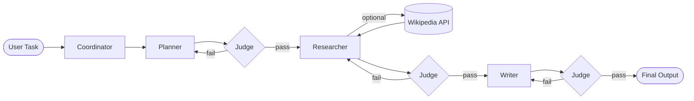

# Divide and Conquer Multi-Agent AI System

A multi-agent AI system that solves complex tasks by dividing work across specialized agents — Planner, Researcher, and Writer — coordinated by an orchestrator and validated by a Judge layer before each stage advances.

Built as a final-semester Agentic AI project for a Complex Computing Problem (CCP), this repository includes the full implementation, evaluation results, research paper, and poster.

## Overview

Instead of relying on a single LLM prompt, this system uses a **divide-and-conquer** pipeline:

1. **Planner** breaks the user task into a research and writing strategy.
2. **Researcher** gathers information and can call a Wikipedia tool when facts are needed.
3. **Writer** produces the final cohesive response from the accumulated context.
4. **Judge** scores every agent output (1–10) and blocks low-quality or off-role responses.
5. **Coordinator** retries failed stages (up to 3 attempts) before aborting the pipeline.

This design adds fault tolerance, role enforcement, and measurable evaluation to a standard multi-agent workflow.

## Architecture



## Key Features

| Problem | Solution |
|--------|----------|
| No fault tolerance | Judge validates each agent output before the pipeline continues |
| Rigid agent roles | Coordinator retries and re-assigns work when the Judge rejects output |
| Role drift | Judge checks adherence to each agent's system prompt |
| No evaluation metric | Quantifiable 1–10 scores per stage, stored for analysis |

## Repository Contents

```
├── project/                  # Python source code
│   ├── main.py               # Entry point — run the system interactively
│   ├── orchestrator.py       # Coordinator, pipeline logic, retry loop
│   ├── agents.py             # Planner, Researcher, Writer, and Judge agents
│   ├── llm_client.py         # Groq LLM client
│   ├── tools.py              # Wikipedia API tool
│   ├── evaluate.py           # Batch evaluation script
│   ├── eval_results.json     # Per-task evaluation data
│   └── eval_summary.txt      # Summary of benchmark runs
├── research paper.pdf        # Research paper
└── research_poster.pptx      # Project poster
```

## Requirements

- Python 3.10+
- A [Groq API key](https://console.groq.com/) (free tier available)

## Setup

1. Clone the repository:

   ```bash
   git clone https://github.com/maryamss-hub/divide-and-conquer-multi-agent-ai-system.git
   cd divide-and-conquer-multi-agent-ai-system/project
   ```

2. Install dependencies:

   ```bash
   pip install -r requirements.txt
   ```

3. Create a `.env` file inside the `project/` folder:

   ```env
   GROQ_API_KEY=your_api_key_here
   ```

## Usage

Run the interactive pipeline:

```bash
python main.py
```

Enter a complex task when prompted (for example: *"Write a report on the causes and effects of climate change"*). The system will run each agent in sequence, show Judge scores in the console, and save the full output to a timestamped `output_YYYYMMDD_HHMMSS.txt` file.

### Run evaluation benchmarks

```bash
python evaluate.py
```

This runs a set of predefined tasks and writes results to `eval_results.json` and `eval_summary.txt`.

## Evaluation Results

The included benchmark run shows strong performance across five diverse tasks, with Judge scores typically 8–9/10 per stage:

| Task | Planner | Researcher | Writer |
|------|---------|------------|--------|
| Climate change report | 9 | 9 | 9 |
| Nuclear energy pros/cons | 9 | 9 | 8 |
| COVID-19 economic impact | 9 | 9 | 9 |
| History and future of AI | 9 | 8 | 9 |
| Causes of World War I | 9 | 9 | 9 |

See `project/eval_summary.txt` and `project/eval_results.json` for full details.

## Tech Stack

- **LLM:** Groq API (via OpenAI-compatible client)
- **Tool integration:** Wikipedia REST API
- **Language:** Python

## Authors

Maryam Khalid — FAST-NUCES Agentic AI semester project
